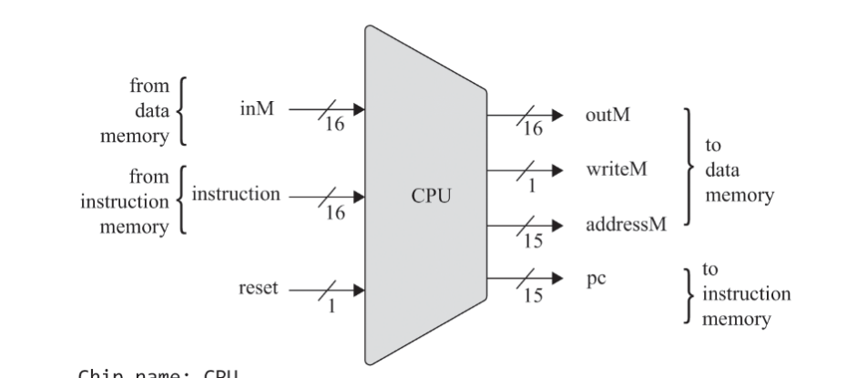
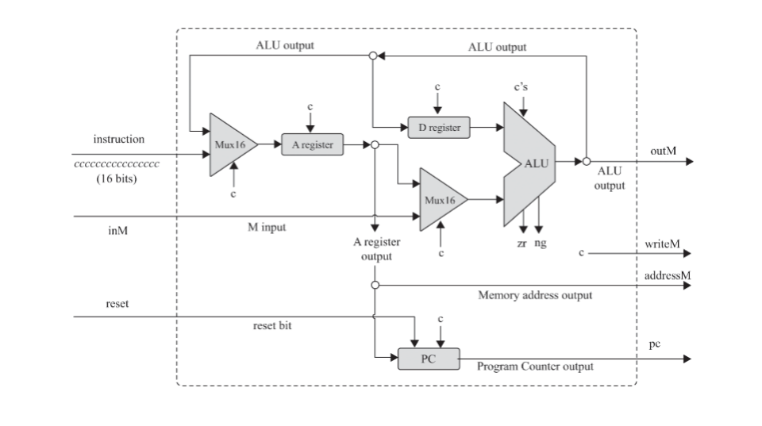
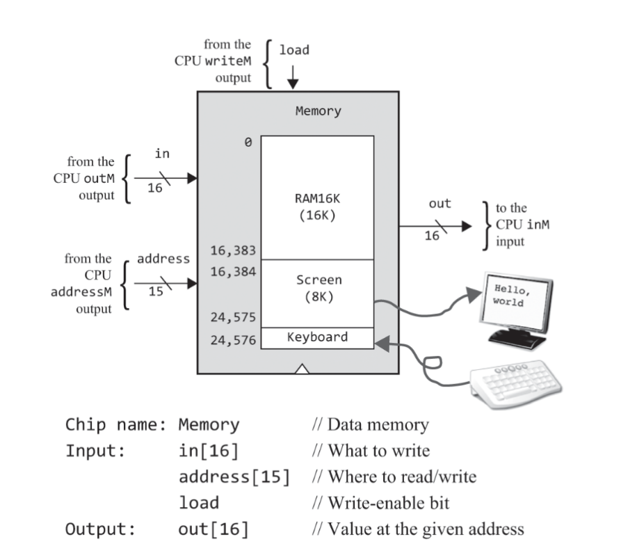

Found this cool video that does something similar: https://youtu.be/Zt0JfmV7CyI?feature=shared
Note: Even after trying alot, nothing i did seems to work. So i'll just use some preexisting code and will try making this on a later date. This is only for the CPU. The rest i could do myself.

# Basic stuff
In this chapter, we make the CPU of the machine on which the assembler and everything of part two will be made.

 I've realized that I don't write much notes in obsidian for this anyways, so i'll just write everything in this folder readmes itself. 

 The chapter starts with an explanation of the stored program concept.

 Especially the Von neumann architecture, which specifies that the program and data are stored in the same memory and are treated the same way.

 This means that the same hardware can act completely differently depending on the software and most of it's functionaility is not hardcoded. 

 Physically, the memory is a linear sequence of addressable,fixed-size registers, each having a unique address and a value. Logically,this address space serves two purposes: storing data and storing instructions. Both the “instruction words” and the “data words” are
implemented exactly the same way—as sequences of bits.

In some variants of the von Neumann architecture, the data memory and the instruction memory are allocated and managed dynamically, as needed, within the same physical address space. In other variants, the data memory and the instruction memory are kept in two
physically separate memory units, each having its own distinct address space.

When the CPU works faster than the rate at which data can be fetched from the memory, the CPU will have to wait for the data to be fetched. This is called the Von Neumann bottleneck.
This is called Starvation. 

To fix this we have on CPU memory called the cache. And beyond that we have the registers. Which is a very small  amount of memory that is directly on the CPU.

To avoid learning about the specific engineering of each IO device, everything is abstracted into a memory mapped IO. This means that
every IO device is mapped to a specific memory address, which is constantly synchronized to check for changes. 

# The Hack specification

**Remember to use the BUILTIN Chips for the ROM32K and RAM16K**

1. 16bit architecture with two memory spaces: data memory and instruction memory. And two specific IO devices, the screen and the keyboard.
2. The CPU consists of the ALU from project 2 and three registers A, D and PC.
    
    
    
3. The instruction memory is one of the prebuilt ROM32K
4. The data memory is one of the prebuilt RAM16K, along with the given Screen and Keyboard memory maps.
    
5. The Topmost level is the Computer Chip, which is connected to the screen and the keyboard. It also has a reset bit.

    When reset==0 The stored program executes
    When reset==1 The execution restarts 
    **TO start execution, set the rest first to 1 and then to 0.**
6. 

