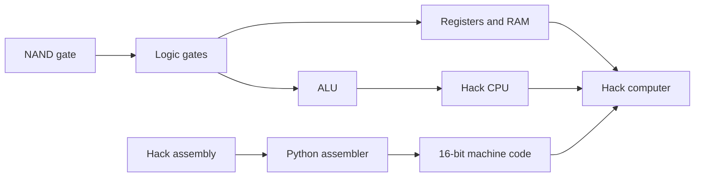
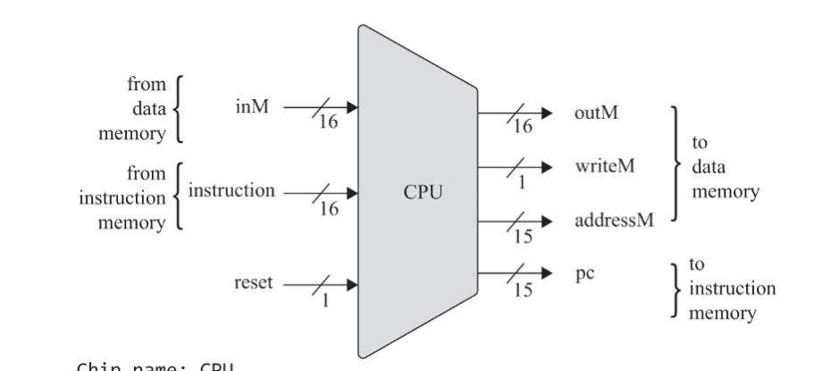
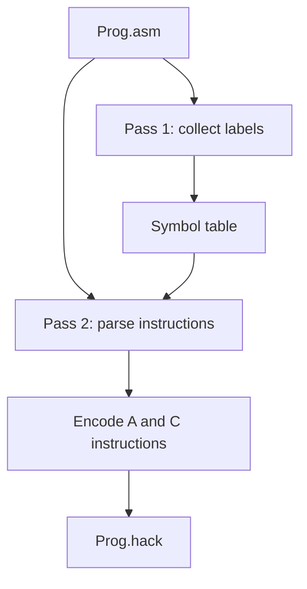

# Nand2Tetris Projects

[](https://github.com/Sukalyan2003/Nand2Tetris/actions/workflows/ci.yml)

My implementations and study notes for the hardware half of [Nand2Tetris](https://www.nand2tetris.org/), progressing from NAND gates to the Hack computer and its assembler.

## Project Map

| Project | Topic | Contents |
| --- | --- | --- |
| [`01`](01/) | Boolean logic | Gates built from NAND |
| [`02`](02/) | Boolean arithmetic | Half adder, full adder, 16-bit adder, incrementer, and ALU |
| [`03`](03/) | Sequential logic | Bit, registers, RAM hierarchy, and program counter |
| [`04`](04/) | Machine language | Hack assembly exercises and notes |
| [`05`](05/) | Computer architecture | CPU, memory, and computer HDL |
| [`06`](06/) | Assembler | Two-pass Python assembler and sample programs |
| [`07`](07/) | Virtual machine | Work in progress |



## Hack Computer Preview

The project 05 implementation connects the ALU, A/D registers, program counter, instruction input, and data-memory interface described by the Hack CPU contract.



## Hack Assembler

The project 06 assembler performs two passes: first recording label ROM addresses, then translating A- and C-instructions into 16-bit Hack machine code.



From the repository root:

```bash
python 06/HackAssembler.py 06/Add.asm
```

This writes `06/Add.hack`. The current implementation supports numeric A-instructions and the label names used by the included programs (`LOOP`, `STOP`, and `END`). General predefined symbols and variables are not implemented yet.

## Development

The HDL projects run in the Hardware Simulator bundled with the Nand2Tetris software suite. The Python assembler tests require Python 3.11+:

```bash
python -m venv .venv
source .venv/bin/activate  # Windows PowerShell: .venv\Scripts\Activate.ps1
python -m pip install -r requirements-dev.txt
python -m pytest -q
```

The pytest suite checks the mnemonic tables, parser behavior, and a complete `.asm` to `.hack` assembly run. The CI badge covers this Python assembler only; verify the HDL projects separately with the Nand2Tetris Hardware Simulator and the course-provided `.tst` scripts.
